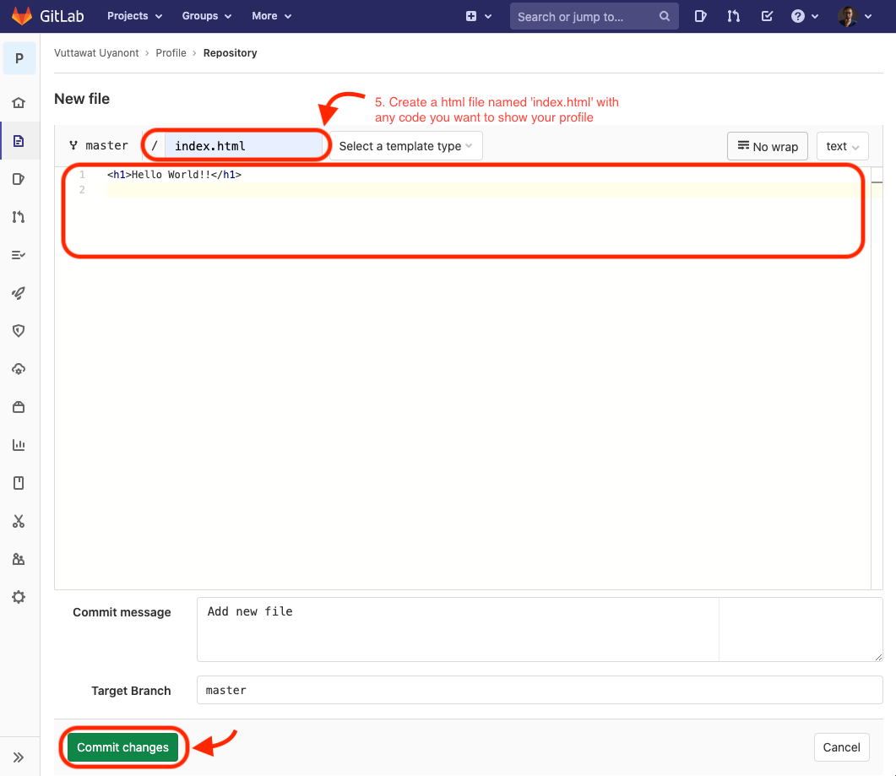
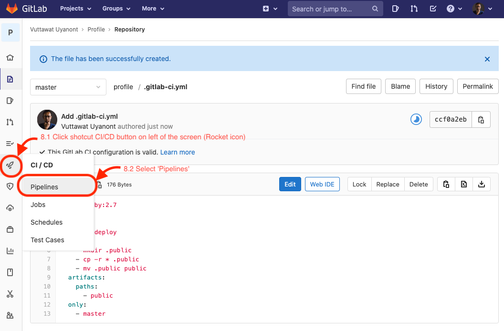

# How to create a new GitLab pages from scratch (HTML pages)

`On GitLab:`
## 1. Create a new blank project.  
  
  
## 2. Detailed project.  
> **2.1** Your project name will be the path of your pages name like: https://'YourGitLabName'.gitlab.io/'YourProjectName'/  
> **2.2** Choose Visibility Level to Public, then click 'Create project' button.  
  
  
## 3. Go to your project 'YourProjectName'.  

## 4. Click "+ New File" button to create a html file.  
  
  
## 5. Create a html file named 'index.html' with any code you want to show your profile, then Commit changes.  
  
    
## 6. Click "+ Set up CI/CD" button.  
  
  
## 7. Create the master/.gitlab-ci.yml file to run your pages.
> **7.1** Create New File >> master/.gitlab-ci.yml  
> **7.2** Copy these text to the file:  
>> image: ruby:2.7  
>>  
>> pages:  
>>   stage: deploy  
>>   script:  
>>     - mkdir .public  
>>     - cp -r * .public  
>>     - mv .public public  
>>   artifacts:  
>>     paths:  
>>       - public  
>>   only:  
>>     - master  
> **7.3** Commit changes to finish.  
  
  
## 8. Check Pipelines.  
> **8.1** Click shortcut CI/CD button on the left of the screen (Rocket icon).  
> **8.2** Select 'Pipelines'  
  
  
## 9. Waiting until Stages of 'Update .gitlab-ci.yml' turn to green correct mark.  
  
  
## 10. Finished! Enjoy your profile pages at https://'YourGitLabName'.gitlab.io/'YourProjectName'/.  
### [This is my GitLab pages, https://hyde4thheaven.gitlab.io/profile/, created by this method. Take a tour!](https://hyde4thheaven.gitlab.io/profile/)
  
______________________________
<table border="0">
 <tr>
    <td> <h3><i>"5 Easy Steps to Spot a Procrastinator:   
      1. Look at</i>
      </h3>
      

      <b> Author: Vuttawat Uyanont </b>   
      Sexiest former engineer and banker who interested in IT & Tech, and Beer.   
      <b>Studying:</b> Master Computer Science in Cybersecurity Management at Mahanakorn University.    </td>  
   <td></td>  
 </tr>
</table>
