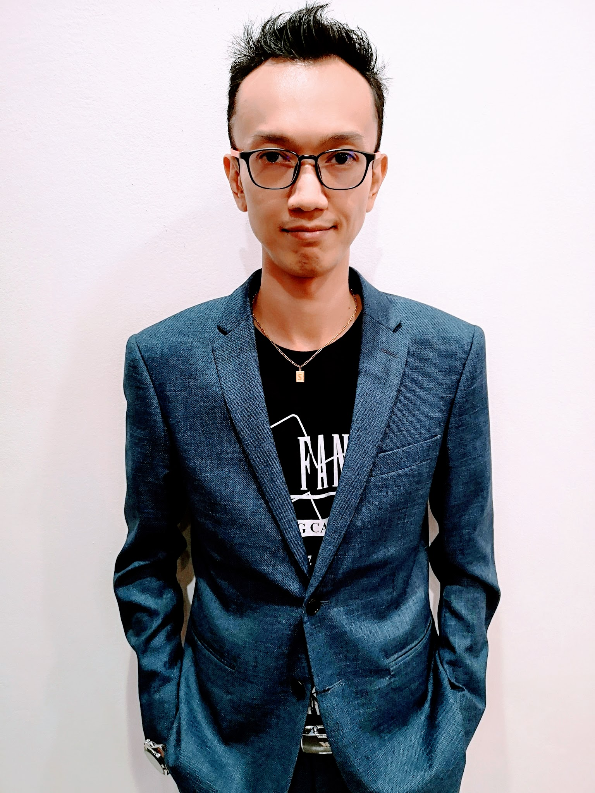
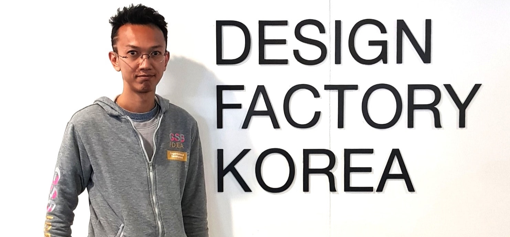

<body style="background-color:#EBF5FB;"> </body>  
  
<table border="0">
 <tr>
  <td></td>
  <td><h1> Vuttawat Uyanont</h1>
      Was born in Bangkok, 1984. <b>A.K.A.</b> Palm / Harry   
      <i>10 years experienced project manager and CEO of THINK COMBO Co., Ltd.</i>   
      <b>Graduated:</b> Bachelor of Engineering (Civil) from Thammasat University, 2006.   
      <b>Studying:</b> Master Computer Science in Cybersecurity Management at Mahanakorn University.  
  </td>
 </tr>
</table>
  
## Careers
> + Starting a job as a civil engineer for 4-years; Airport Rail Link, buildings, oil and gas plant projects.  
> + Back in during the years 2006-2009, financial trends grow very fast and will be the future of the world in 2010-2020, I decided to turn my career to the financial and banking sector, at *[Government Savings Bank](https://www.gsb.or.th)*. From evaluating officer, procurement officer, to electronic government procurement (e-GP) lecturer and procurement planning manager, also acting CEO of the special strategic team in the smart procurement development project.  
> + To live my own life and find something driven by my skills, in 2019, I move to *[FWD Insurance Co., Ltd.](https://www.fwd.co.th)* as a digital distribution project manager.  
  
## Awards and Licenses  
  
Year | Awards and Achievements
------ | ------

2018>/div> | **GSB Excellence Award**, Organizational Development.

2017
 | **GSB KM Award**, Procurement Knownledge Management.
2019 – Present | License for **Life Insurance Agent**.
2006 – Present | License for **Professional Practice, Associate Civil Engineer**.
  
## Lives
> + Haven't any experience in direct-Cybersecurity but have to coordinate some work with stakeholders.  
> + Intermediate programming skills.  
> + Interested in IT & Tech, Banking, Financial, Real Estate, and Business.  
> + Look for an opportunity in both Cybersecurity and Blockchain technology.  

## Hobbies
> + Crafted beer  
> + Trading Card Game  
> + Go  
  
## On the back of my contents created
> + [How to create a new GitLab pages from scratch (HTML pages)](https://hyde4thheaven.github.io/How-to-Create-GitLab-Pages/)  
> + [Look-up Secret Verifier in Security Requirements based on the Application Security Verification Standard and Digital Identity Guidelines](https://gitlab.com/Hyde4thHeaven/profile/-/wikis/Look-up-Secret-Verifier)
  
## Keep in touch with me via:  
{:height="50%" width="50%" style="float: right"}  
- [x] **LinkedIn** {:height="2%" width="2%"} - [My LinkedIn](https://www.linkedin.com/in/v-uyanont/)  
- [x] **GitHub** {:height="2%" width="2%"} - [My GitHub](https://github.com/Hyde4thHeaven/)  
- [ ] **Facebook** {:height="2%" width="2%"} - PM me yours first :)  
- [ ] **Twitter** {:height="2%" width="2%"} - Sorry! for sniffing only :P  
